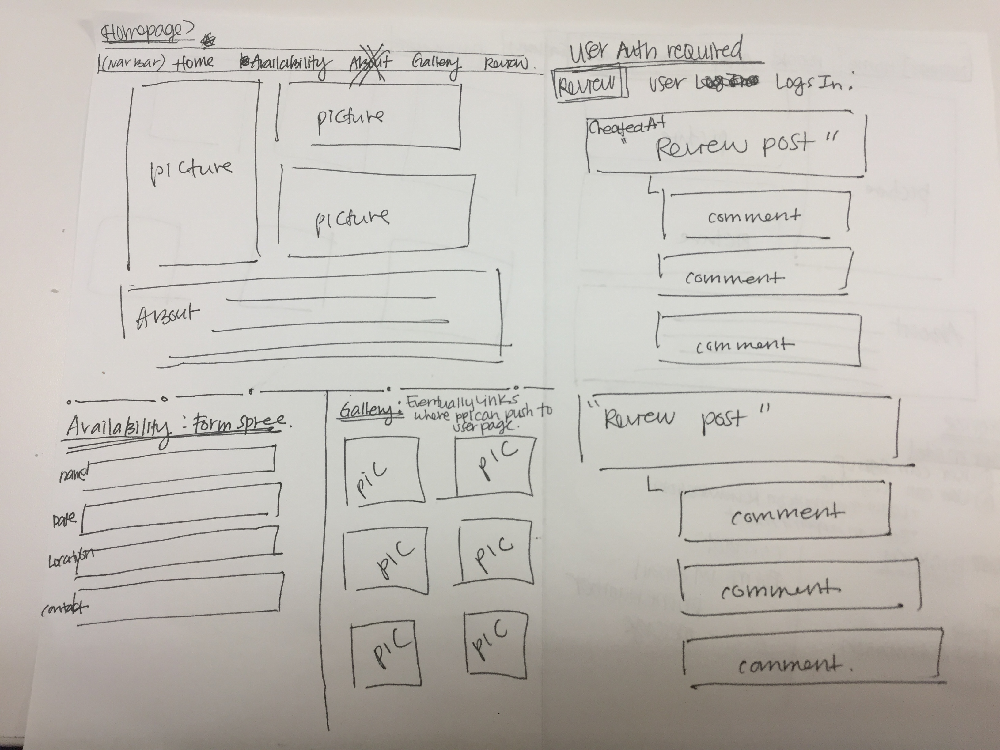
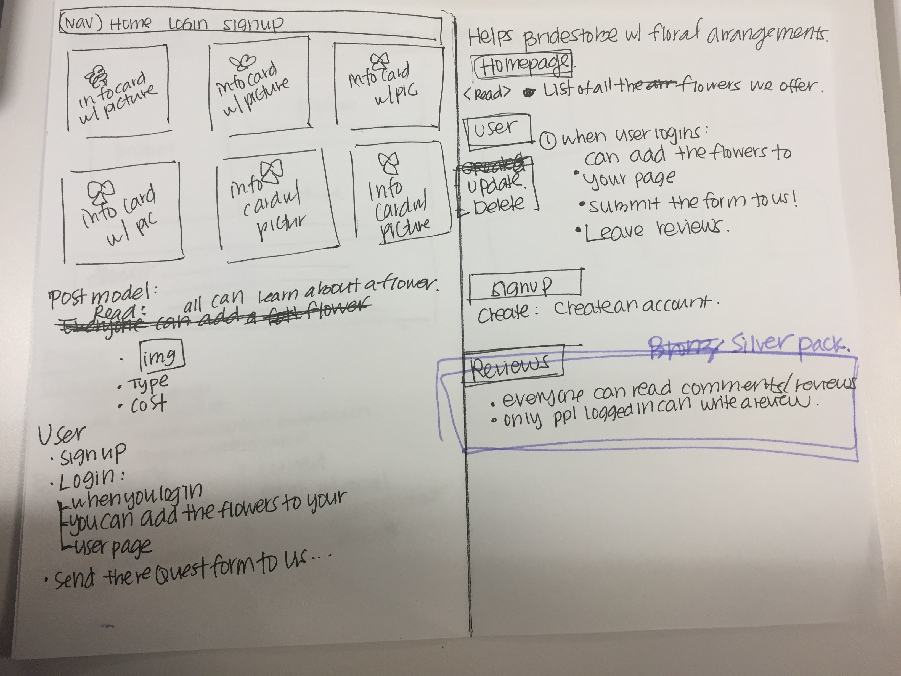

# **Business Pinterest- Cozy Corner**

## **Cozy Corner**

Cozy corner is a small, local, family owned flower boutique that specializes in wedding arrangements.

Although we are still small, our customer base is growing and many of our clients ask if we have a website. I would like to create a simple web application to help our business grow.

## **Web Application with Django and Python**

_Bronze Package_

_Silver Package_

### **Bronze package : Minimally Viable Product**

The Bronze package will be the basic bones of the website with a homepage, a form where you can check our availability and contact us, gallery and user signup and login.

- **Homepage** - (**Read**)

  - Show three pictures
  - Show an about us blurb
  - Contact us footer with icons to our email and phone number

- **Availability** : Form with **Formspree**

  - Create a form that sends to our email with:

    - Client Name
    - Client Phone Number
    - Client Email
    - Wedding Date
    - Wedding Location
    - Items needed
    - Budget

- **Gallery**
  - Samples all of the floral arrangements we've done in cards
- **Signup**: (**Create**)
  - Sign up to create an account
- **User**
  - Log-In
    - Post reviews
    - Other users can also make comments on the reviews

### **Silver Package : Pinterest using floral arrangements**

Many times, brides have a hard time articulating what type of flowers or arrangements they want for bridal bouquets, groomsmen boutineers, and or centerpieces.

Once the base website is made:

- Users can update his/her user page by clicking on the photos in the gallery and adding it to his/her User page
- Client can then send us his/her chosen arrangements with customization notes (if needed) to help us craft the perfect arrangement for your wedding needs
